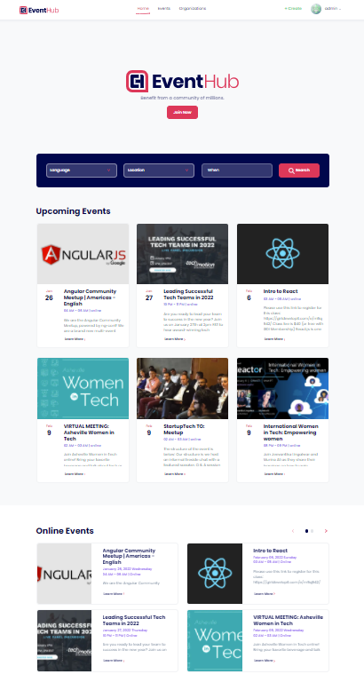
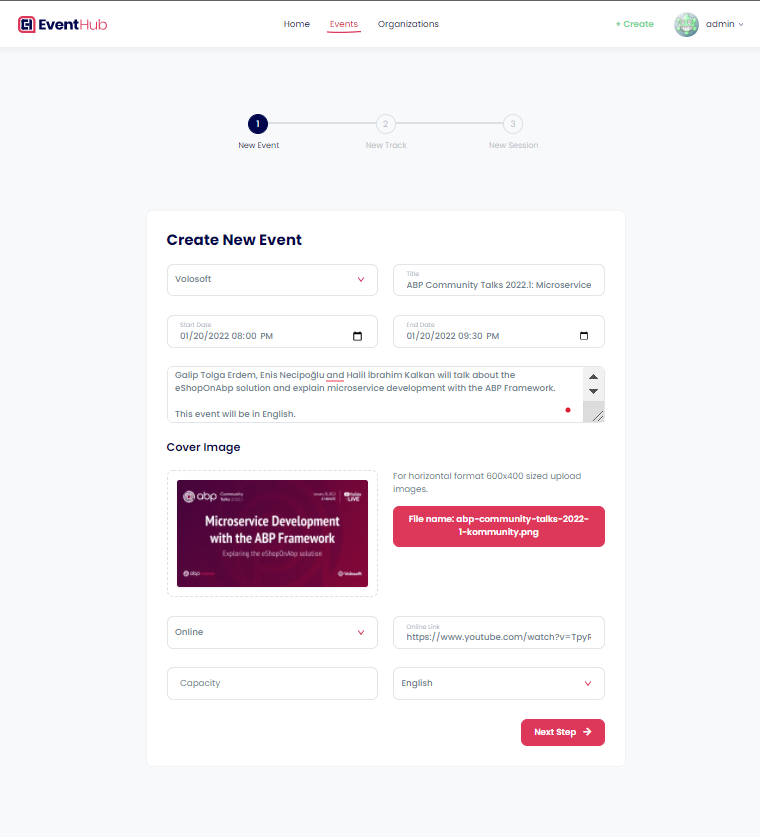
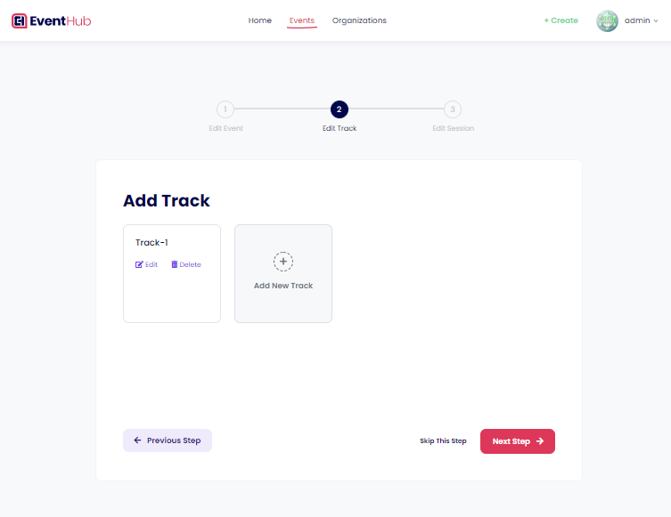
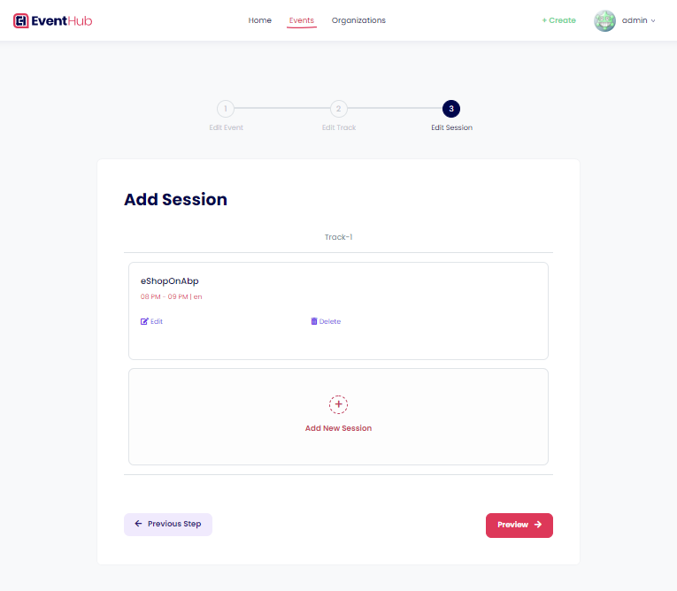
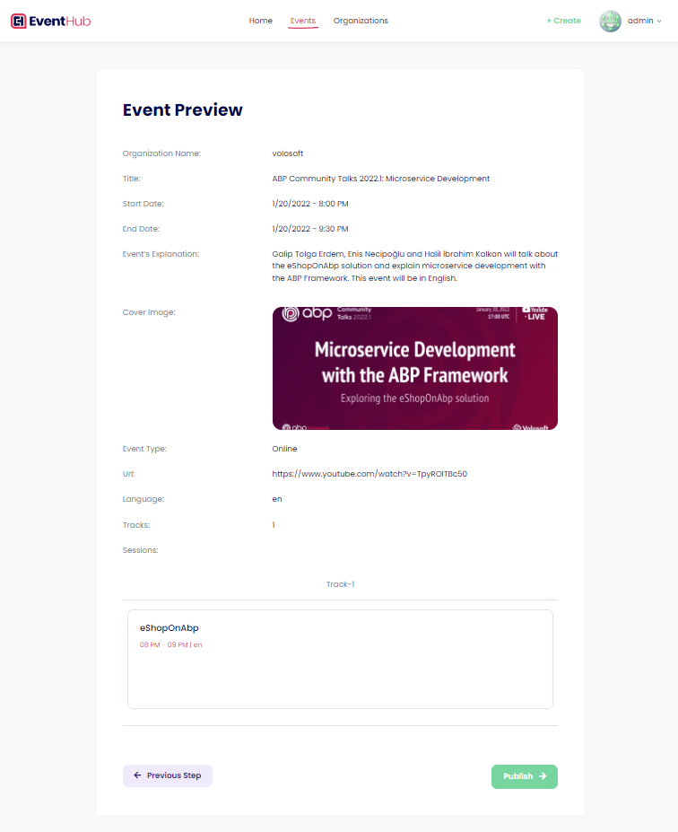
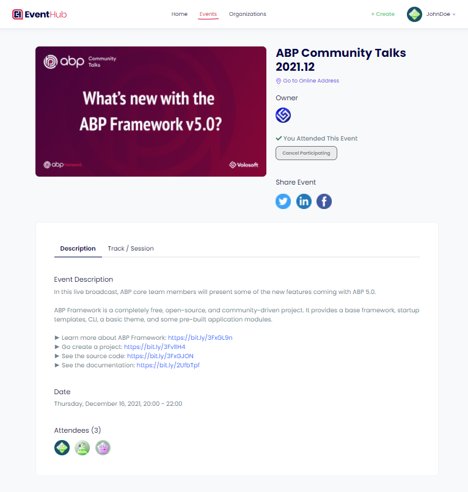
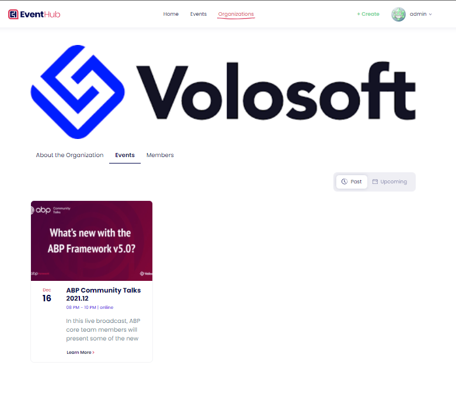
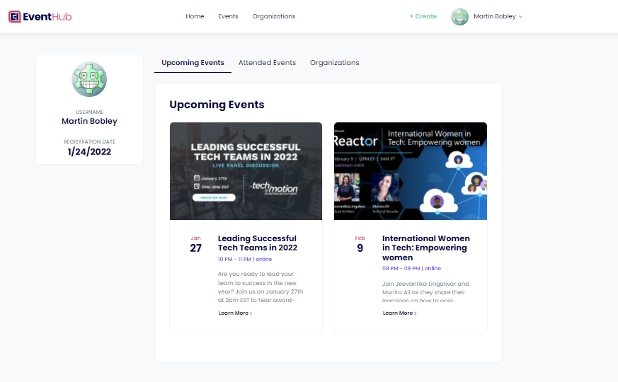
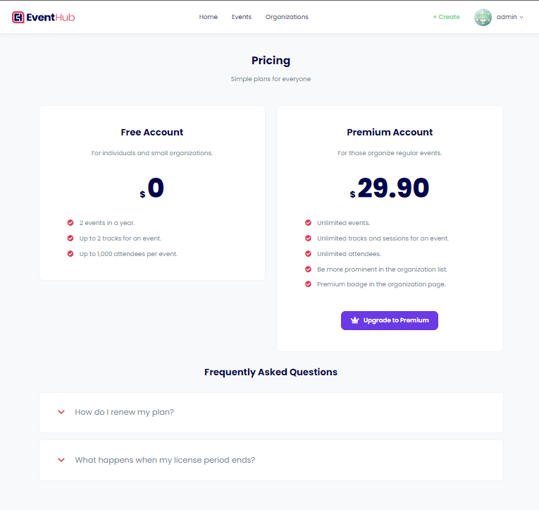
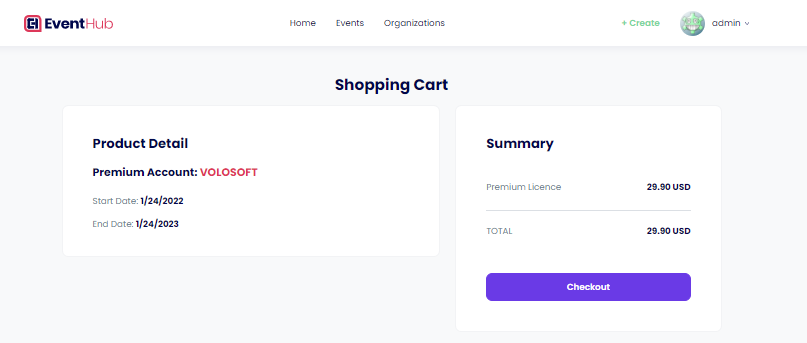

# EventHub

This is a reference application built with the ABP Framework. It implements the Domain Driven Design with multiple application layers.

## The book

This solution is originally prepared to be a real-world example for the **Mastering ABP Framework** book.

**The book is the only source that explains this solution**. This solution is highly referred in *Understanding the Reference Solution*, *Domain Driven Design* and other parts of the book.

**You can order the book on [Amazon](https://www.amazon.com/gp/product/B097Z2DM8Q) or on [Packt](https://www.packtpub.com/product/mastering-abp-framework/9781801079242).**

## Requirements

* .NET 6.0+
* Docker

## How to run

* Run `etc/docker/up.ps1` before running the solution.
* Run `EventHub.DbMigrator` to create the database and seed initial data.
* Run `EventHub.IdentityServer`
* Run `EventHub.HttpApi.Host`
* Run `EventHub.Web`
* Run `EventHub.Admin.HttpApi.Host`
* Run `EventHub.Web.Admin`

`admin` user's password is `1q2w3E*`

## See live

See the solution live on https://openeventhub.com

## Screenshots

### Public Web Side - (MVC/Razor Page UI)

#### Home Page

#### Event Creation Page

The event creation process consists of three steps: "Create a New Event", "Add Tracks to the Event (optional)" and "Add Sessions to the Tracks (optional)".

* After these steps, an "Event Preview" page is shown to the user to check the event details and publish the event.

##### Create a New Event

##### Add Tracks to the Event (optional)

##### Add Sessions to the Tracks (optional)

#### New Event Preview Page

#### Events Page

#### Event Details Page

#### Organizations Page

#### Organization Details Page

#### Profile Page

#### Payment Module Pages

The payment module provides an API to make payments via **PayPal** easily. This application uses this module to perform payment transactions.

> To learn more about the **Payment Module** and see the integration, please check out the [payment module documentation](modules/payment/README.md).

##### Pricing Page

#### Pre-Checkout Page

